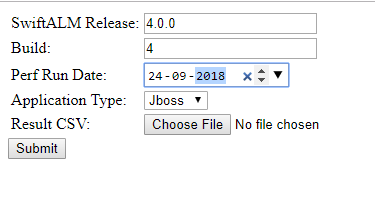
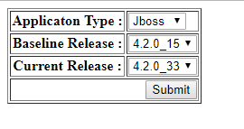
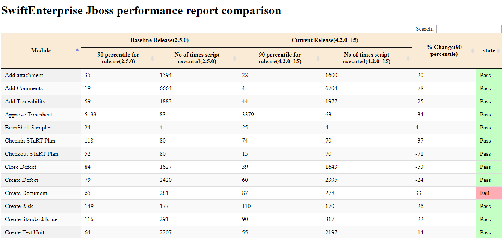

[](https://dev.azure.com/swiftops/swiftops/_build/latest?definitionId=1)

# jMeter Performace Result Upload Utility

### Indoduction
[jMeter](https://jmeter.apache.org/) is an Open Source testing software. It is 100% pure Java application for load and performance testing. jMeter is designed to cover categories of tests like load, functional, performance, regression, etc.

jMeter run produces output in various format like xml, csv etc. This utility has micro-services that would read .csv report and store it into Mongo db provided by user.The result stored in mongo db can be used to compare results between two different runs.

The mircro-services can be run inside docker container or you can also run the servies as standalone on your system.

There are two services:

* uploadcsv
* perfcompareui

##### What does uploadcsv micro-service do?
upload csv service would display a html form which would take Product Release,Build,Perf Run Date,Application Type and Result CSV as input parameters and would store the the data to mongo db on click of submit button.

##### What does perfcompareui micro-service do?
perfcompareui service would display a html form which would take Applicaton Type,Baseline Release and Current Release as input parameters and on click of submit button a html page would be displayed which would show comparsion result based on input parameters passed.

### Assumption

1. This microservice for Jmeter Automation run. So It is assumed that jmeter  has been installed on your system.
2. Jmeter run report should be saved in XML format.


### Pre-Requisite

1. python 3.6.0 or above version.
2. docker (optional) Refer [Install Docker](https://www.digitalocean.com/community/tutorials/how-to-install-and-use-docker-on-ubuntu-16-04) documentation.
3. docker-compose
4. linux os (optional)


### Installation
##### Checkout Repository
Checkout project code from git.
```
git clone https://github.com/digitedevops/jmeter-performance-report-parser.git
```

##### Configuration
You have to specify your database ip,port,db name and collection name in config.ini file which  would be used to establish connection with mongo db.File is located at root directory.
example.


[mongo_Params]
1. mongo_ip = 10.0.2.10
2. mongo_port = 27017
3. db_name = perf_db
4. db_collection = perf_coll


##### Run services
In order to run this script, need to run below script from command line under project root directory.

```
   python services.py
``` 

### How to use
In order to call above microservices. we just need to hit below URL  from the browser

1.For uploadcsv 
```
	http://<yourip>:5002/uploadcsv
```
On successfull start of your micro-service a html page would be displayed as below :

	


Example:
1. SwiftALM Release: 4.0.0  (your product release)
2. Build: 20 (your release build number)
3. Perf Run Date: 20/09/1994 (your jmeter result run date)
4. Application Type : Jboss (your application server ,i.e jboss or wildfly)
5. Result CSV: click on choose file button and browse to the path were jmeter xml file is present.(for demo purpose xml file is given in jmeter_csv_file_example directory which can be found at root of project.)


2.For perfcompareui
```	
	http://<yourip>:5002/perfcompareui
```

On successfull start of your micro-service a html page would be displayed as below :




Example:
1. Applicaton Type : Jboss (your application server name)
2. Baseline Release : 4.2.0_15 (select your jmeter performance baseline release from available dropdown)
3. Current Release : 4.4.0_25 (elect your jmeter performance current release from available dropdown)


On clicking submit button a performance report in form of html page would be displayed which would display comparison result based on Baseline Release and Current Release present if present in db.




#### To deploy your sevices inside docker

Run docker compose file using below cmd:
```
docker-compose up --build
```
1.Above command  start a mongo db which would have perf_db and perf_coll collection with pre-imported jmeter xml files for 	your  reference.

2.It would also start a docker container which would up the jMeter-Performance-Report-Parser microservices.

#### On Commit Auto-deploy on specific server.

To autodeploy your docker container based service on server used below steps

You need to configure Gitlab Runner to execute Gitlab CI/CD Pipeline. See [Gitlab Config](https://docs.gitlab.com/runner/install)
As soon as you configure runner auto deployment will start as you commited the code in repository.
refer .gitlab-ci.yml file.
	


  

